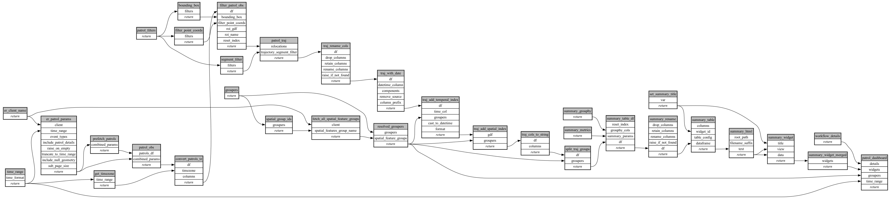

```
# AUTOGENERATED BY ECOSCOPE-WORKFLOWS; see fingerprint in README.md for details

```

```yaml
# fingerprint:
artifacts_sha256_basic: 3177dd51bf547db6422d4a3c73993d3b811fa22f4b0d6b53e23649fa5f107823
artifacts_sha256_strict: edec4dde8ffd8771082511453ac949ede6a1492216fb694814a9254af38f3e5e
installed_requirements:
- channel: https://repo.prefix.dev/ecoscope-workflows/
  name: ecoscope-platform
  version: {version: ==2.16.6}
- channel: https://repo.prefix.dev/ecoscope-workflows-custom/
  name: ecoscope-workflows-ext-custom
  version: {version: ==0.1.0rc18}
- channel: conda-forge
  name: pydeck
  version: {version: ==0.9.2}
params_sha256: 54a5c8282054d85603e7e6fbea66109c2d5df24ac01c3e32adf9abf6a8fdee82
spec_sha256: 95faf42843a909e7b114492510f090bf197e2eb6fb9fc4fa312c435e11729061

```

# ecoscope-workflows-patrol-effort-table-workflow


