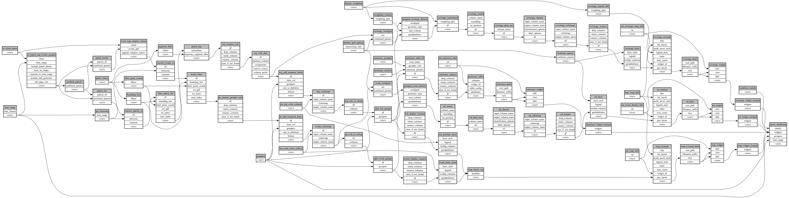

```
# AUTOGENERATED BY ECOSCOPE-WORKFLOWS; see fingerprint in README.md for details

```

```yaml
# fingerprint:
artifacts_sha256_basic: 355914d4189af30e0a0463f8b09f8d28ae2044740780f016ea51282efc98ab5e
artifacts_sha256_strict: 2e717b7fa2908c3c5139663b554a694bf7fc8d76cae696f939f0f9aaa979e399
installed_requirements:
- channel: conda-forge
  name: python
  version: {version: ==3.12.13}
- channel: https://repo.prefix.dev/ecoscope-workflows/
  name: wt-task
  version: {version: ==0.1.3}
- channel: conda-forge
  name: numpy
  version: {version: ==2.0.2}
- channel: conda-forge
  name: pyarrow
  version: {version: ==23.0.1}
- channel: conda-forge
  name: pandas
  version: {version: ==2.3.3}
- channel: conda-forge
  name: geopandas
  version: {version: ==1.1.4}
- channel: conda-forge
  name: rasterio
  version: {version: ==1.5.0}
- channel: https://repo.prefix.dev/ecoscope-workflows-custom/
  name: pydeck
  version: {version: ==0.0.2}
- channel: conda-forge
  name: setuptools
  version: {version: ==80.10.2}
- channel: conda-forge
  name: pydantic
  version: {version: ==2.8.2}
params_sha256: 837d0e5c910e6c23f02d5714277acb4a6439a09c21616bff5a62d167dc1e995b
spec_sha256: 293fb4eae3a1ca1ea41d2f3db9e329e07bd9526d1ae6dfcc9e310bcb32a9fcee

```

# ecoscope-workflows-patrol-efforts-workflow


