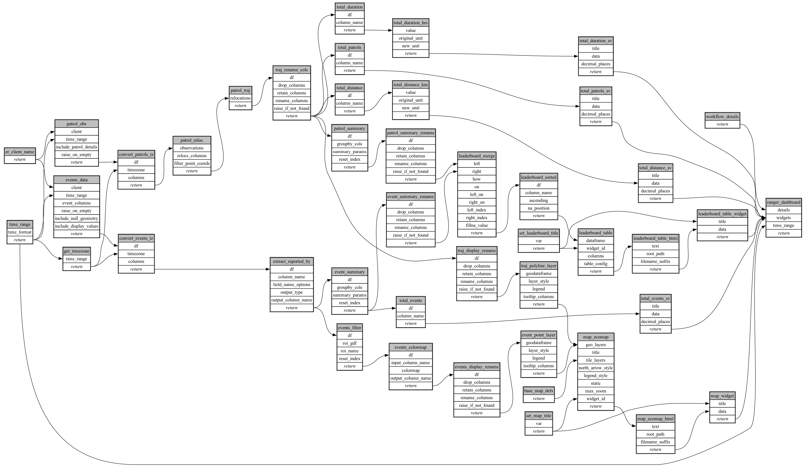

```
# AUTOGENERATED BY ECOSCOPE-WORKFLOWS; see fingerprint in README.md for details

```

```yaml
# fingerprint:
artifacts_sha256_basic: 
  5e34ef52c77248fd3a595bf871f6a54705dfe951d9de8281ceb4a74944bb5ec5
artifacts_sha256_strict: 
  c57badfbc4236e2cdfb3ad7d785762051b04e3fc005c087f843c7f045fdd7fef
installed_requirements:
- channel: https://repo.prefix.dev/ecoscope-workflows/
  name: ecoscope-platform
  version: {version: ==2.11.15}
- channel: https://repo.prefix.dev/ecoscope-workflows-custom/
  name: ecoscope-workflows-ext-custom
  version: {version: ==0.1.0rc6}
params_sha256: e0667cca2a0c10cf5d4b4f8f4fd3d89dc853dd77f86750ef31a3d584f8702f78
spec_sha256: 949c4a8e7dc260f5b2e03299c39eac25643e5729b8fd963e0202928dc8959d1b

```

# ecoscope-workflows-ranger-workflow


